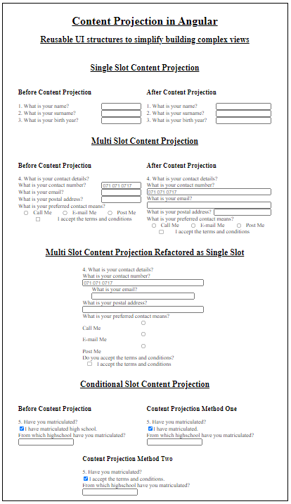

# Content Projection In Angular
Reusable UI structures to simplify building complex views

This project was generated with [Angular CLI](https://github.com/angular/angular-cli) version 11.0.2.

## Blog Information
Content Projection is a powerful directive used within Angular and it allows us to encapsulate elements into components that are fully customisable. This is achieved by injecting custom HTML into these components. In other words, parts of the component would change based on the currently displayed screen and DOM.

This article demonstrates how Content Projection can simplify your code by breaking down complex views and creating reusable directives that remove duplication in your views.

I hope you can now see that Transclusion can help you improve your component reusability and ultimately to simplify dynamic DOM manipulation.

If you would like to learn more about this please have a look at the Official Documentation here, where you can learn other topics such as the default template.

Thank you for reading my article. I hope you learned something new and exciting, and that you now have a better understanding of Content Projection or Transclusion and the various types you can use to improve your code.

Please feel free to leave a comment if you need clarification or if you have something to add. You can also find a complete GitHub repository for this topic here.

If you enjoyed this article please also check the [DVT Engineering](https://medium.com/dvt-engineering) space for more interesting articles and follow [me](https://medium.com/@frossouw) for future topics.

## Starting the Applicaiton
1. Clone the project from GitHUb into a folder on your computer.
2. Run `npm install` in the terminal to install all dependencies.
3. Run `ng serve` for a local development server.
4. Navigate to `http://localhost:4200/` to see the application running.

## Screenshot of Content Projection Application

